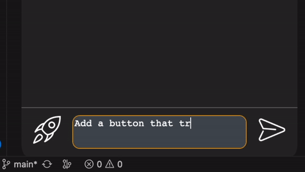
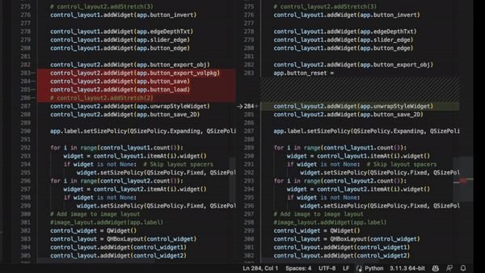
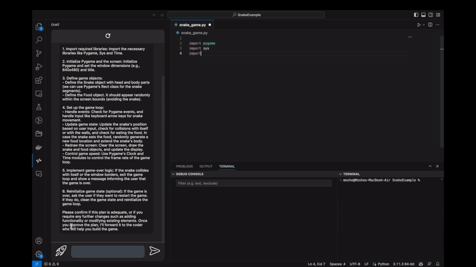
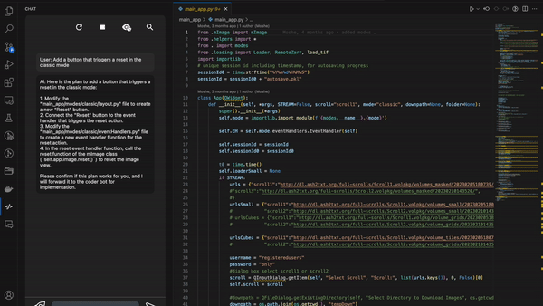
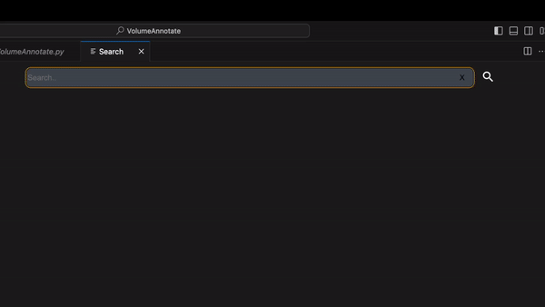

# Junior
Junior is a code writing agent designed to be seamlessly integrated into your workflow.
## Multi-File Edits

Junior has access to your current workspace. Saying "add new feature X" will result in a series of modifications in multiple files, resulting in the requested feature.

All edits are streamed in real time to diffs, where you can accept, reject, or modify changes.

## From Scratch

You can also create new projects from scratch by simply describing them. Junior will create the necessary files and populate them with code.

## Large Codebases

Junior handles large codebases by automatically pulling only relevant code into its context. You can view and modify this context inline.

You can also utilize this backend search manually to jump to relevant portions of code.
